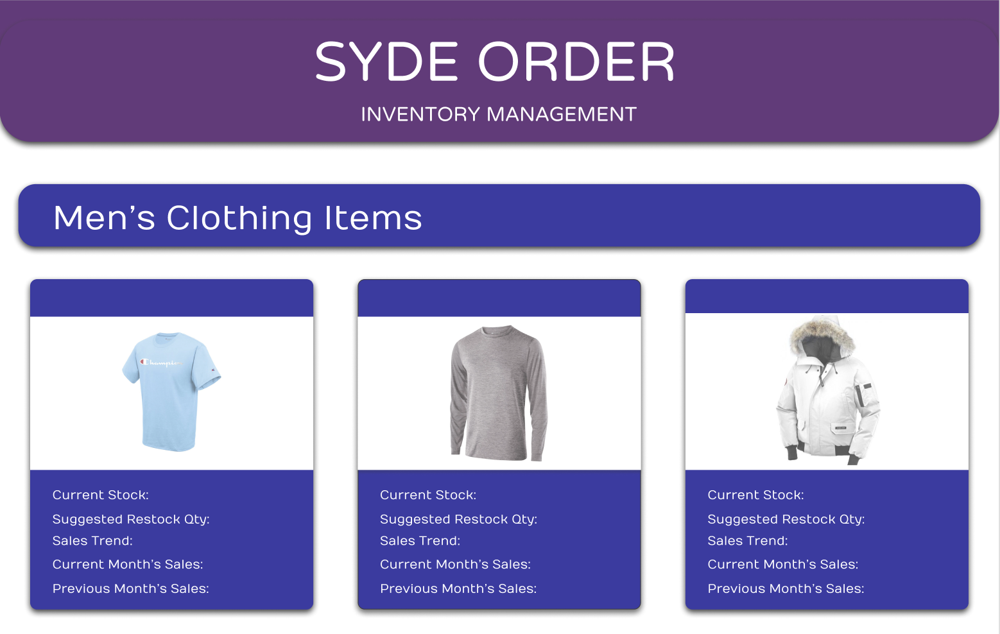

# SYDE-Order
:department_store: A simulation web app to help retailers manage their inventory and obtain useful sales data.

Download all necessary files and frameworks:

Install HomeBrew
```ShellSession
$ /usr/bin/ruby -e "$(curl -fsSL https://raw.githubusercontent.com/Homebrew/install/master/install)"
$ brew install wget
```

Install Python3 with Brew
```ShellSession
$ brew install python3
```

Install pip3
```ShellSession
$ curl https://bootstrap.pypa.io/get-pip.py -o get-pip.py
$ python3 get-pip.py
```

Install Flask 
```ShellSession
$ pip3 install Flask
```

After installing the packages, navigate to your local directory in the terminal using ```$ cd <FolderName>``` and type the following in the terminal:
```ShellSession
$ export FLASK_APP=app.py
$ flask run
```
Paste the given localhost domain into your browser. You are all set! :sunglasses:

## What is SYDE Order? 
SYDE Order is a simple web app that simulates a seamless experience for potential retailers to organize and manage their inventory more effectively by offering them easy-to-read data regarding their current inventory, sales trends, and recommended restock quantities of certain items. The main goal here is to make their business more sustainable and develop a habit of making accurate restocks to avoid wasteful overstocking and maximizing profits. 

### Team
[Daniel Kim](https://github.com/dannyhkim), [Seth Villaruz Morenos](https://github.com/DraconianWing), and [Kha Nguyen](https://github.com/Nguyen-Kha) developed this project together. Daniel's role was to implement the dynamic back-end elements of the app using Flask App, as well develop some of the front-end interface in HTML & CSS. Seth was in charge of the UI/UX Design of the app which he created in Figma, and Kha was the main front-end developer who transitioned the Figma designs into HTML/CSS code. 

### Photos

